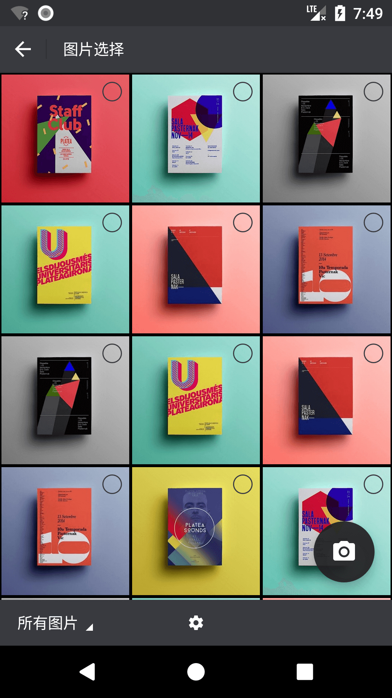
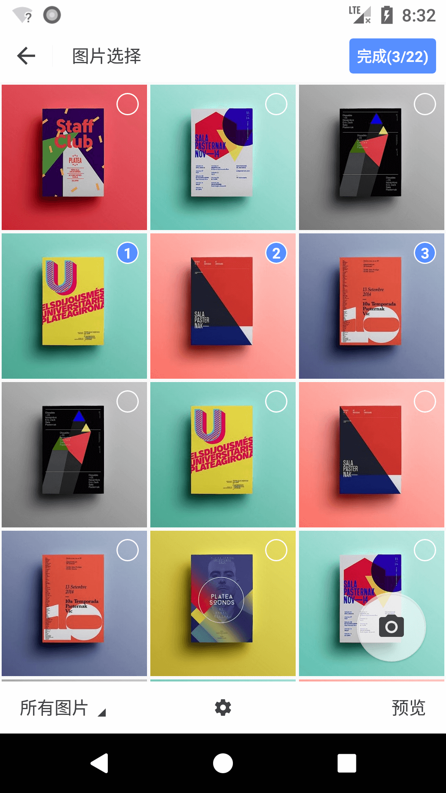
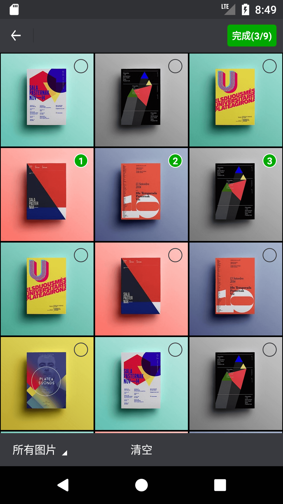
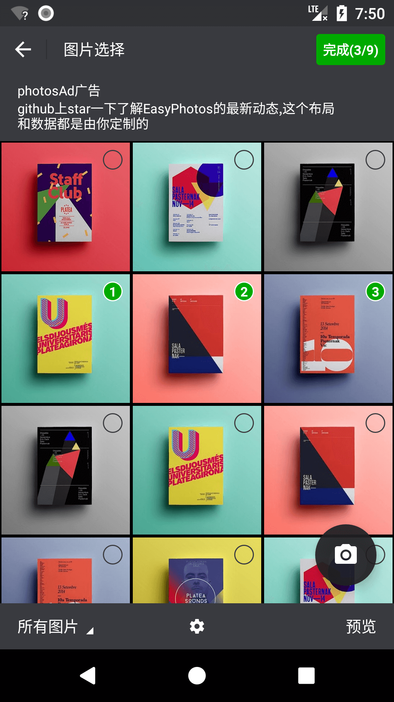
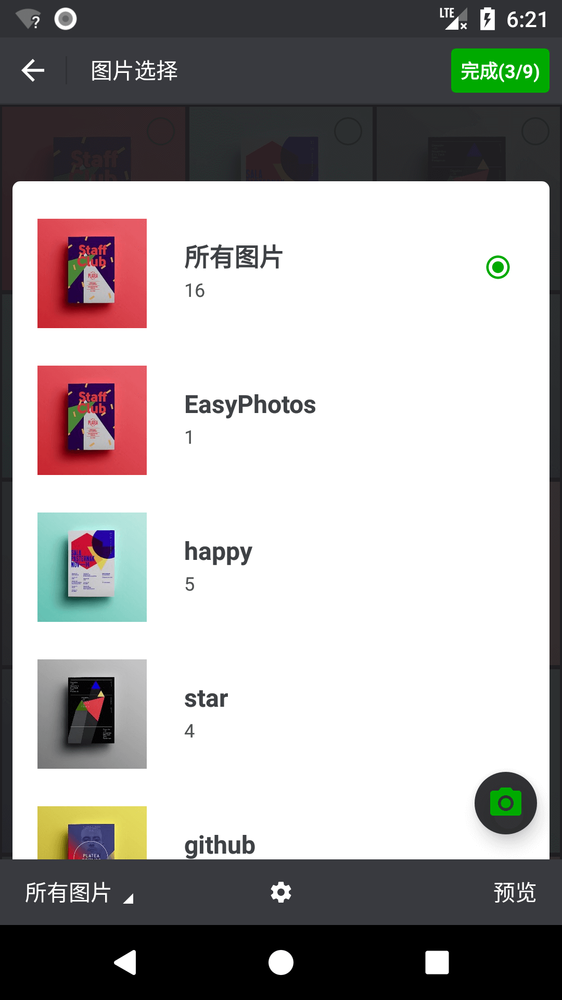
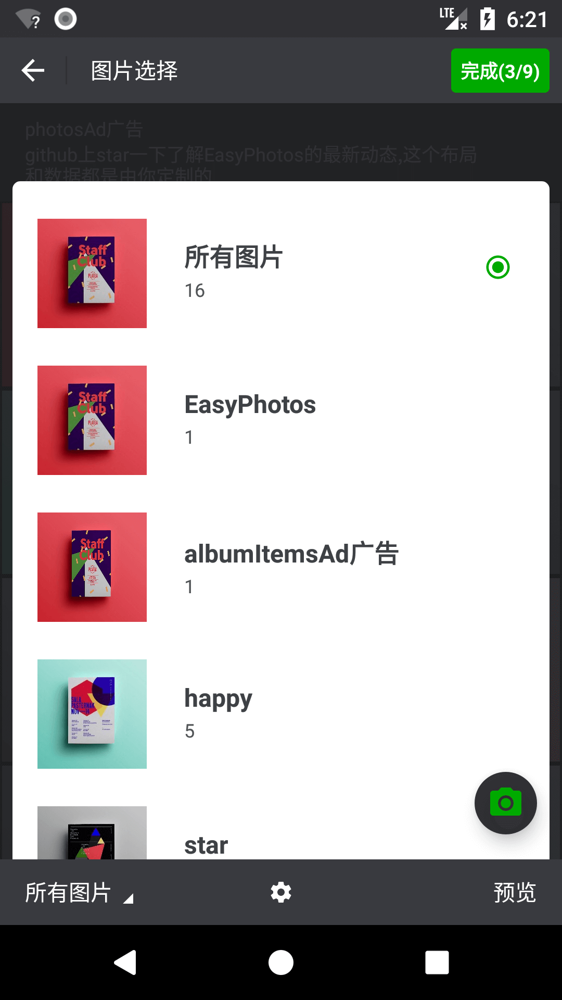
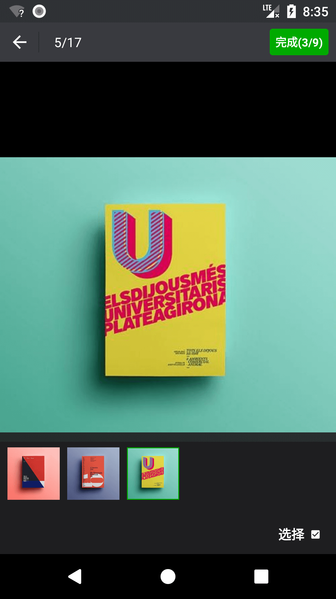
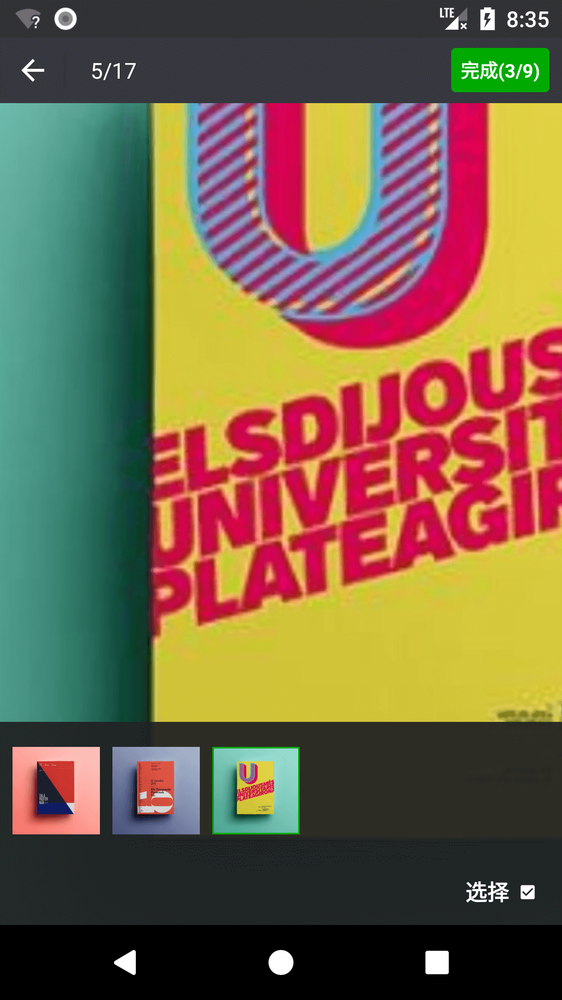
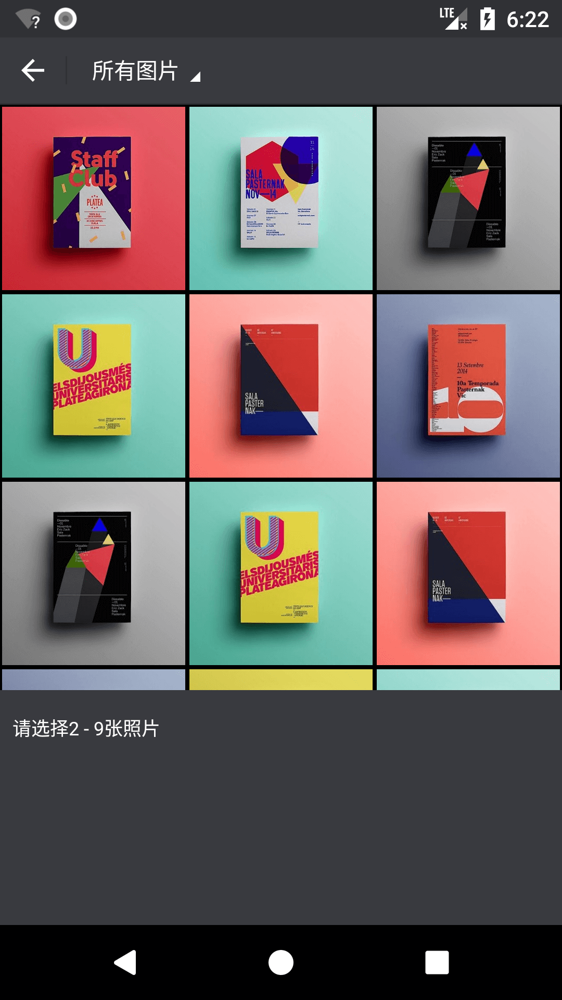
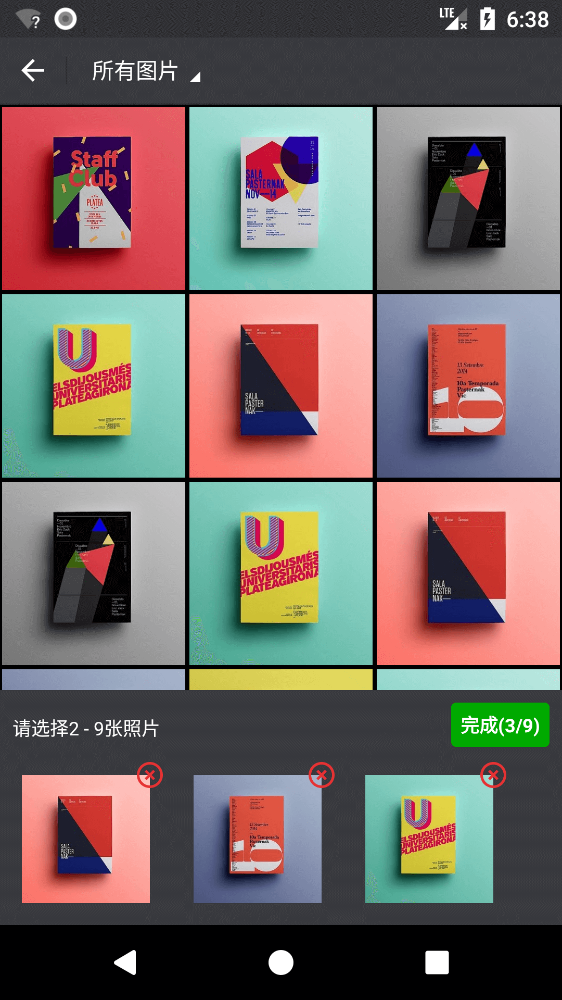

### 编者语    

EasyPhotos将在高颜值、高兼容、高性能、强功能的道路上持续更新，欢迎各种Issues，我将及时反馈，谢谢！

### 更新日志    
      
**1.2.6：**    
- 正式开放，投入使用   
- 广告view可以传空，适用于VIP不显示广告场景

**1.2.3：**    
- 优化图片限制方式：最小宽度、最小高度、最小文件大小    
- 如果单一设置，满足条件即过滤    
- 如果多项设置，满足一项即过滤    

**1.2.2：**     
- 新增返回结果：图片地址集合   
- 新增返回结果：用户是否选中原图选项    
- 新增返回结果：图片信息集合    
- 新增设置默认勾选图片集合方式：图片地址集合   
- 新增设置默认勾选图片集合方式：图片信息集合   

**1.2.1：**   
- 优化预览界面全屏动效
- 优化Photo实体对象  

**1.2.0：**   
- 升级图片选取返回信息（图片地址/宽高/文件大小/文件修改时间/文件类型/用户是否点击原图选项/文件名）
- 图片选择新增原图选项
- 预览界面支持选择完成
- 预览界面支持当前图片位置显示
**1.1.1：**   
- 优化相机和相册的调用API，使之更加友好    

**1.1.0：**   
- 增加图片添加水印功能  
- 增加媒体文件更新到媒体库功能

**1.0.9：**   
- 优化三星部分机型因图片更新到媒体库时没有更新宽高信息时EasyPhotos相册不显示该图片问题

**1.0.8：**   
- 优化自定义UI和多语言

**1.0.7：**   
- 性能优化

**1.0.6：**   
- 修复华为VNS-L31机型拍照无返回问题

**1.0.5：**   
- 修复拍照切换横竖屏发生内存泄漏
- 修复切换语言时产生错误
- 升级glide为最新版4.3.0   

**1.0.4：**    
- 直接启动相机  
- 相册单选  
- 相册多选  
- 相册中支持添加自定义广告  
- 图片预览（缩放/全屏）
- UI可定制  
- 根据图片宽高进行过滤 
- 修复无图片显示时的异常    
- 内部处理权限问题，无需配置，无需处理运行时权限
    
    
    

   
# EasyPhotos
EasyPhotos会帮助你快速实现android的拍照、相册与文件夹中图片选择（单选/多选）、相册选择界面的广告View填充，展示图片宽高限制、图片预览（含缩放）、图片添加水印、媒体文件更新到媒体库、自定义UI等功能，而无需考虑运行时权限、无图片显示、工具库与应用UI不统一等问题。  

| 无选中状态   | 相册单选  | 相册多选 |
|:-----------:|:--------:|:---------:|
| |  | |  

| 相册带相机 | 相册带相机带广告 | 专辑列表|
|:-------:|:---------:|:---------:|
| |  | |  

| 专辑列表带广告   |  预览页 | 预览页单击图片转全屏模式 | 
|:-------:|:---------:|:---------:|
| |  | |   

|预览页缩放图片 | 预览页单击缩放图片显示操作栏| 持续更新 |
|:-------:|:---------:|:---------:|
| |  | |    
  
    
## 关于EasyPhotos的SDK及相关版本公示 
compileSdkVersion 26  
minSdkVersion 15  
targetSdkVersion 26  
buildToolsVersion '26.0.2'  
dependencies {
        classpath 'com.android.tools.build:gradle:3.0.0'
    }  
`android studio` 3.0正式版

## 获取EasyPhotos（通过Gradle方式）
首先，在项目的 `build.gradle（project）` 文件里面添加:

```gradle
allprojects {
	repositories {  
	
	//EasyPhotos的  
        maven { url "https://jitpack.io" }
	
	//以下是Glide的
	mavenCentral()
  	maven { url 'https://maven.google.com' }
    }
}
```

最后，在你需要用到EasyPhotos的module中的 `build.gradle（module）` 文件里面添加：
```gradle
dependencies {  

    //这个是EasyPhotos
    compile 'com.github.HuanTanSheng:easyPhotos:1.2.6'  
    
    //以下是Glide
    compile 'com.github.bumptech.glide:glide:4.3.0'
    annotationProcessor 'com.github.bumptech.glide:compiler:4.3.0'  
    
    //以下是PhotoView
    compile 'com.github.chrisbanes:PhotoView:2.1.3'
}
```    

为什么要添加Glide和PhotoView的引用呢？  
答：EasyPhotos使用了两个开源库的功能，他们是[Glide 4.x](https://github.com/bumptech/glide)和[PhotoView](https://github.com/chrisbanes/PhotoView)。    
因为他们足够热门，所以为了避免给你造成重复引用的可能，EasyPhotos中对他们进行了provided方式（只编译不打包场景的命令）的引用，可以理解为EasyPhotos并没有真正获取她们，所以需要你在项目中对她们进行引用依赖。  
      
- 如果在引用的时候发生如下错误 ( 如果用android studio 3.0正式版，将不会出现这个问题 ) :    
Error:Failed to resolve: annotationProcessor   
Error:Failed to resolve: com.android.support:support-annotations:26.0.2    
这个应该是引用Glide时发生的，推荐你将 `android studio` 升级到3.0正式版，或者在你所有的`build.gradle（module）`文件里面添加（我并不推荐这样做，还是建议你将 `android studio` 升级到3.0正式版）：  

```gradle  

configurations.all {
    resolutionStrategy.force 'com.android.support:support-annotations:23.1.1'
}  

```    
  
- 如果你的 `android studio` 版本低于3.0正式版，有可能会打不开我的Demo，只需要修改Demo里面 `build.gradle（project）` 文件中的：  
```gradle  

dependencies {
        classpath 'com.android.tools.build:gradle:3.0.0'
	//把3.0.0改成你对应的版本即可，如果不清楚对应版本可以看看你其他正常项目的这里是怎么写的  
	}

```  
  
## 关于混淆    
  
**EasyPhotos的混淆：**  
```pro  

-keep class com.huantansheng.easyphotos.constant.** { *; }  
-keep class com.huantansheng.easyphotos.models.** { *; }

```
**[Glide 4.x](https://github.com/bumptech/glide)的混淆：**   
```pro  

-keep public class * implements com.bumptech.glide.module.GlideModule
-keep public class * extends com.bumptech.glide.AppGlideModule
-keep public enum com.bumptech.glide.load.resource.bitmap.ImageHeaderParser$** {
    **[] $VALUES;
    public *;
}

```

**[PhotoView](https://github.com/chrisbanes/PhotoView)的混淆：** 不需要任何处理


## [EasyPhotos文档总录](https://github.com/HuanTanSheng/EasyPhotos/wiki)
* [关于权限](https://github.com/HuanTanSheng/EasyPhotos/wiki/%E5%85%B3%E4%BA%8E%E6%9D%83%E9%99%90)
* [相机与相册](https://github.com/HuanTanSheng/EasyPhotos/wiki/%E7%9B%B8%E6%9C%BA%E4%B8%8E%E7%9B%B8%E5%86%8C)  
* [图片添加水印](https://github.com/HuanTanSheng/EasyPhotos/wiki/%E5%9B%BE%E7%89%87%E6%B7%BB%E5%8A%A0%E6%B0%B4%E5%8D%B0)
* [Bitmap回收](https://github.com/HuanTanSheng/EasyPhotos/wiki/Bitmap%E5%9B%9E%E6%94%B6)
* [更新媒体文件到媒体库](https://github.com/HuanTanSheng/EasyPhotos/wiki/%E6%9B%B4%E6%96%B0%E5%AA%92%E4%BD%93%E6%96%87%E4%BB%B6%E5%88%B0%E5%AA%92%E4%BD%93%E5%BA%93)
* [屏幕方向设置](https://github.com/HuanTanSheng/EasyPhotos/wiki/%E5%B1%8F%E5%B9%95%E6%96%B9%E5%90%91%E8%AE%BE%E7%BD%AE)
* [自定义UI样式](https://github.com/HuanTanSheng/EasyPhotos/wiki/%E8%87%AA%E5%AE%9A%E4%B9%89UI%E6%A0%B7%E5%BC%8F)
* [多语言](https://github.com/HuanTanSheng/EasyPhotos/wiki/%E5%A4%9A%E8%AF%AD%E8%A8%80)

## 感谢 
[Glide](https://github.com/bumptech/glide)：我心目中最好的图像加载和缓存库，由[Bump Technologies](https://github.com/bumptech) 团队编写    

[PhotoView](https://github.com/chrisbanes/PhotoView)：一个强大的图片缩放库，由[chrisbanes](https://github.com/chrisbanes) 大神编写    

