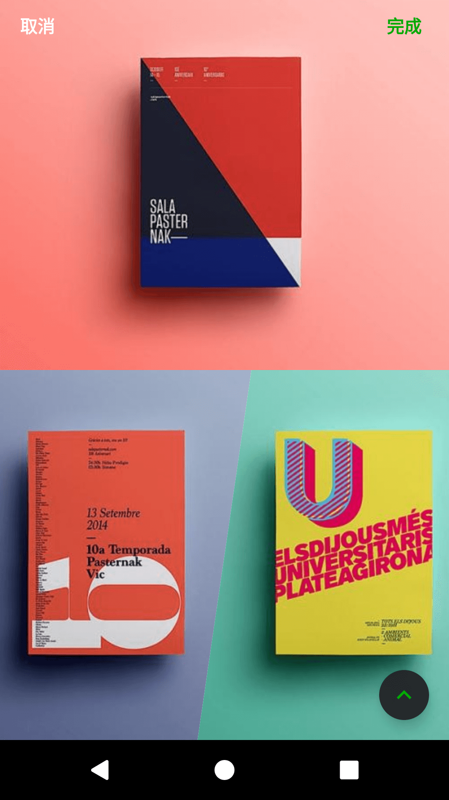
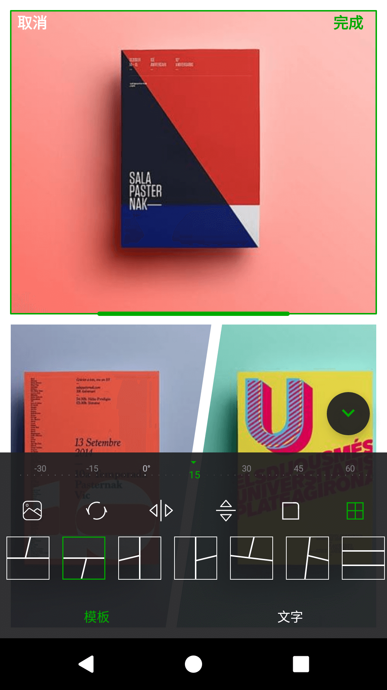
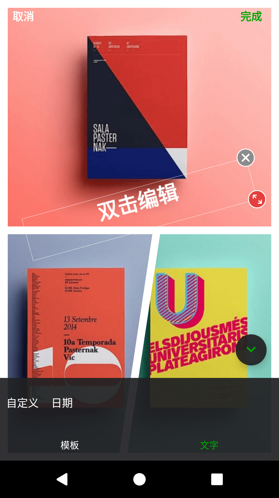
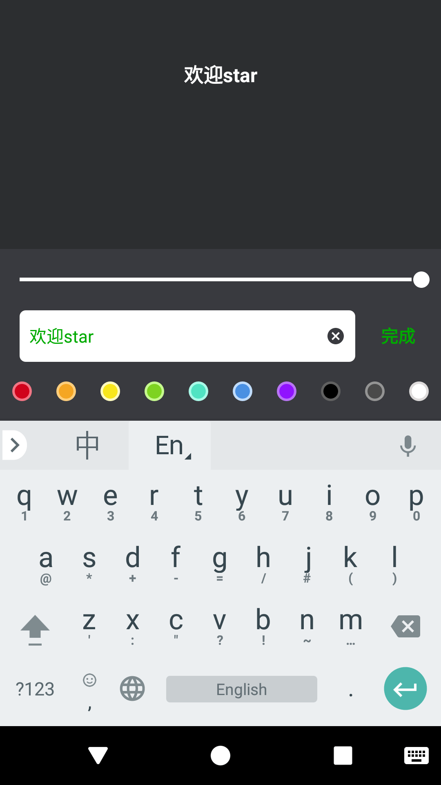
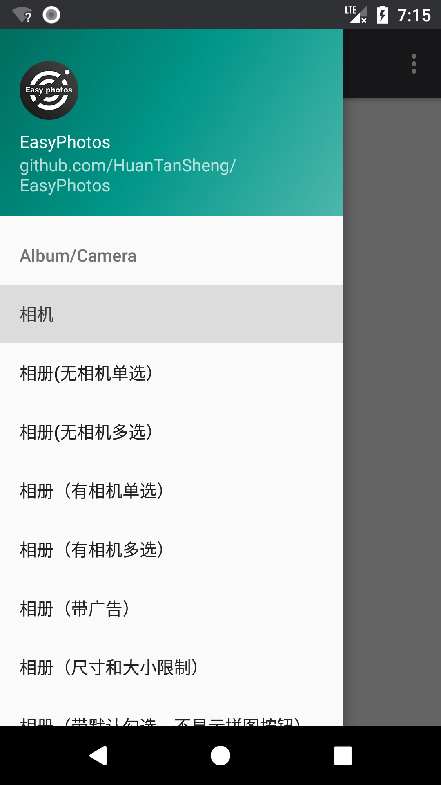
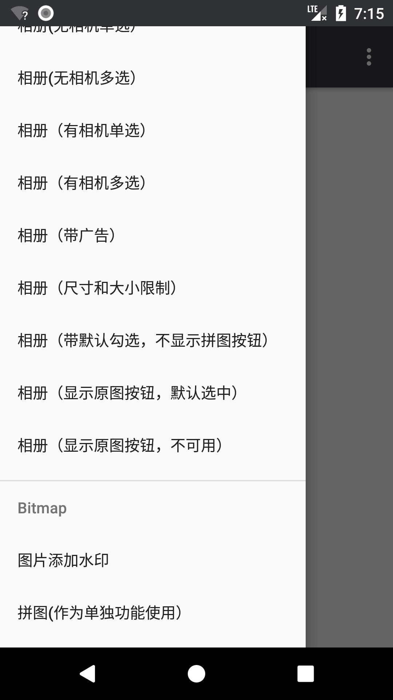

# EasyPhotos    
[](https://jitpack.io/#HuanTanSheng/EasyPhotos)    

QQ交流群：[288600953](https://jq.qq.com/?_wv=1027&k=5QGgCDe)    


EasyPhotos会帮助你快速实现android的拍照、相册与文件夹中图片选择（单选/多选）、文字贴纸、相册选择界面的广告View填充，展示图片宽高限制、图片预览（含缩放）、图片添加水印、拼图、保存图片到指定文件夹、把View画成Bitmap、媒体文件更新到媒体库、自定义UI等功能，而无需考虑运行时权限、无图片显示、工具库与应用UI不统一等问题。  

| 无选中状态   | 选中状态  | 其他功能（各功能可自选） |
|:-----------:|:--------:|:---------:|
| |  | |  

| 专辑列表 | 相册带广告 | 专辑列表带广告 |
|:-------:|:---------:|:---------:|
| |  | |  

| 预览页   |  预览页单击图片转全屏模式 | 预览页缩放图片 | 
|:-------:|:---------:|:---------:|
| |  | |   

|预览页单击缩放图片显示操作栏 | 拼图选择页| 拼图选择页 |
|:-------:|:---------:|:---------:|
| |  | |     

|拼图页 | 拼图页拼图功能| 拼图页文字贴纸功能 |
|:-------:|:---------:|:---------:|
| |  | |     

|文字贴纸编辑页 | 示例功能列表 | 示例功能列表 |
|:-------:|:---------:|:---------:|
| |  | |    
    
## 关于EasyPhotos的SDK及相关版本公示 
compileSdkVersion 27  
minSdkVersion 15  
targetSdkVersion 27      
buildToolsVersion '27.0.3'    
QQ交流群：[288600953](https://jq.qq.com/?_wv=1027&k=5QGgCDe)    


## 获取EasyPhotos（通过Gradle方式）
首先，在项目的 `build.gradle（project）` 文件里面添加:

```gradle
allprojects {
	repositories {  

        maven { url "https://jitpack.io" }
	
    }
}
```

最后，在你需要用到EasyPhotos的module中的 `build.gradle（module）` 文件里面添加：
```gradle
dependencies {  

    implementation 'com.github.HuanTanSheng:EasyPhotos:2.1.0'  
    
}
```    
    
**关于EasyPhotos内部依赖Glide和PhotoView的说明。**     

EasyPhotos内部通过implementation方式引用了他们，这样做的好处是：    

1、如果你也使用Glide，你不需要担心你的Glide版本和我的不兼容，而且亲测，在这种方式依赖下，同时依赖两个Glide，安装包文件大小基本没什么变化。    

2、如果你没有使用Glide，你不需要更换你的图片加载库，而EasyPhotos通过这种方式依赖Glide带来的文件增幅只有216Kb。    

3、如果你也使用PhotoView，你不需要担心你的PhotoView版本和我的不兼容，而且亲测，在这种方式依赖下，同时依赖两个PhotoView，安装包文件大小基本没什么变化。    

4、如果你没有使用PhotoView，你不需要更换你的图片缩放库，而EasyPhotos通过这种方式依赖PhotoView带来的文件增幅只有9Kb。    

5、EasyPhotos会始终保持他们的最新版依赖，体验更加，又不破坏你的习惯。    
    
    
**如果你的 `android studio` 版本不同于3.0.1正式版，有可能会打不开我的Demo，只需要修改Demo里面 `build.gradle（project）` 文件中的：**     

```gradle  

dependencies {
        classpath 'com.android.tools.build:gradle:3.0.1'
	//把3.0.1改成你对应的版本即可，如果不清楚对应版本可以看看你其他正常项目的这里是怎么写的  
	}

```    
    
## 关于混淆    
  
**EasyPhotos的混淆：**  
```pro  

-keep class com.huantansheng.easyphotos.constant.** { *; }  
-keep class com.huantansheng.easyphotos.models.** { *; }

```
**[Glide 4.x](https://github.com/bumptech/glide)的混淆：**   
```pro  

-keep public class * implements com.bumptech.glide.module.GlideModule
-keep public class * extends com.bumptech.glide.module.AppGlideModule
-keep public enum com.bumptech.glide.load.resource.bitmap.ImageHeaderParser$** {
  **[] $VALUES;
  public *;
}

# for DexGuard only
#-keepresourcexmlelements manifest/application/meta-data@value=GlideModule

```

**[PhotoView](https://github.com/chrisbanes/PhotoView)的混淆：**    
```pro   
不需要任何处理    
```
    
    
  
## EasyPhotos文档总录    

## [EasyPhotos文档总录](https://github.com/HuanTanSheng/EasyPhotos/wiki)
* [01-关于权限](https://github.com/HuanTanSheng/EasyPhotos/wiki/01-%E5%85%B3%E4%BA%8E%E6%9D%83%E9%99%90)
* [02-相机与相册](https://github.com/HuanTanSheng/EasyPhotos/wiki/02-%E7%9B%B8%E6%9C%BA%E4%B8%8E%E7%9B%B8%E5%86%8C)    
* [03-拼图（单独使用）](https://github.com/HuanTanSheng/EasyPhotos/wiki/03-%E6%8B%BC%E5%9B%BE%EF%BC%88%E5%8D%95%E7%8B%AC%E4%BD%BF%E7%94%A8%EF%BC%89)      
* [04-图片添加水印](https://github.com/HuanTanSheng/EasyPhotos/wiki/04-%E5%9B%BE%E7%89%87%E6%B7%BB%E5%8A%A0%E6%B0%B4%E5%8D%B0)     
* [05-把View画成Bitmap](https://github.com/HuanTanSheng/EasyPhotos/wiki/05-%E6%8A%8AView%E7%94%BB%E6%88%90Bitmap)    
* [06-保存Bitmap到指定文件夹](https://github.com/HuanTanSheng/EasyPhotos/wiki/06-%E4%BF%9D%E5%AD%98Bitmap%E5%88%B0%E6%8C%87%E5%AE%9A%E6%96%87%E4%BB%B6%E5%A4%B9)    
* [07-Bitmap回收](https://github.com/HuanTanSheng/EasyPhotos/wiki/07-Bitmap%E5%9B%9E%E6%94%B6)
* [08-更新媒体文件到媒体库](https://github.com/HuanTanSheng/EasyPhotos/wiki/08-%E6%9B%B4%E6%96%B0%E5%AA%92%E4%BD%93%E6%96%87%E4%BB%B6%E5%88%B0%E5%AA%92%E4%BD%93%E5%BA%93)
* [09-屏幕方向设置](https://github.com/HuanTanSheng/EasyPhotos/wiki/09-%E5%B1%8F%E5%B9%95%E6%96%B9%E5%90%91%E8%AE%BE%E7%BD%AE)
* [10-自定义UI样式](https://github.com/HuanTanSheng/EasyPhotos/wiki/10-%E8%87%AA%E5%AE%9A%E4%B9%89UI%E6%A0%B7%E5%BC%8F)
* [11-多语言](https://github.com/HuanTanSheng/EasyPhotos/wiki/11-%E5%A4%9A%E8%AF%AD%E8%A8%80)     
    
QQ交流群：[288600953](https://jq.qq.com/?_wv=1027&k=5QGgCDe)    
    
       
           
	   
## 感谢 
[Glide](https://github.com/bumptech/glide)：我心目中最好的图像加载和缓存库，由[Bump Technologies](https://github.com/bumptech) 团队编写    

[PhotoView](https://github.com/chrisbanes/PhotoView)：一个强大的图片缩放库，由[chrisbanes](https://github.com/chrisbanes) 大神编写    
    
[PuzzleView](https://github.com/wuapnjie/PuzzleView)：一个强大的拼图库，我的拼图功能是在此基础上实现，这个库由[wuapnjie](https://github.com/wuapnjie) 编写，因对其不了解，不妄作评价，推荐大家去关注一下。    
    
## 编者语    

EasyPhotos将在高颜值、高兼容、高性能、强功能的道路上持续更新，欢迎各种Issues，我将及时反馈，谢谢！    
QQ交流群：[288600953](https://jq.qq.com/?_wv=1027&k=5QGgCDe)      


## 更新日志     
    
    
**2.1.0：**    
- 新增功能：EasyPhotos自动识别状态栏颜色，当状态栏趋近白色时，只能适配黑色字体。（该功能仅对6.0以上系统生效，并没有适配6.0以下的小米和魅族，如有需要可以加群交流）    
- 新增功能：可配置是否显示Gif动图    
- 功能优化：Gif动图的处理方式。
- 界面优化：Gif动图、相机按钮等。
- 新增字段：<string name="gif_easy_photos">动图</string>    
- 内部升级：最新版编译工具和最新版sdk

**2.0.2：**    
- 升级：Glide到4.5.0（不影响低版本使用）    
- 修复：拼一张功能因图片过多过大导致的oom问题    
- 感谢@[Beiler](https://github.com/beiler) 提出的反馈      
    
    
**2.0.1：**    
- 修复bug：单独使用拼图功能时，以图片路径为参数时产生的数组越界bug。   

**2.0.0：**   
- 新增功能：相册内部自带拼一张功能（可通过配置不使用该功能，该模式拼图保存的图片存储在 sd卡根目录/你的app_name 文件夹下）   
- 新增功能：拼图页面增加文字贴纸功能    
- 界面优化：无权限时的相册界面优化，使之更加友好    
- 界面优化：相机按钮优化，视觉和体验上都更加友好    
- 界面优化：专辑列表细节优化，更加自然、大气     
- 功能优化：相册界面打开相机，拍照后不直接返回，而是默认选中拍完的图片，停留在相册界面
- 字段增加：具体查看[11-多语言](https://github.com/HuanTanSheng/EasyPhotos/wiki/11-%E5%A4%9A%E8%AF%AD%E8%A8%80)      
- 重要修改：Photo对象去除isCamera成员变量。构造函数也因此相应改变，少了一个参数。
- 重要修改：setFileProviderAuthoritiesText（）方法更改为setFileProviderAuthority（）方法    
- 重要修改：UI色值重新定义，由原来的三十几种色值统一修改为7个色值，自定义起来更加方便。具体查看[10-自定义UI样式](https://github.com/HuanTanSheng/EasyPhotos/wiki/10-%E8%87%AA%E5%AE%9A%E4%B9%89UI%E6%A0%B7%E5%BC%8F)


**1.3.2：**   
- 新增功能：    
    - 拼图（最多对9张图片进行拼图，无需关心运行时权限，内部处理好了）    
    - 把View画成Bitmap    
    - 保存bitmap到本地（可设置是否更新到媒体库，如果调用此方法前没有进入过EasyPhotos的相册或相机，则需要你自己处理读写权限）      
- 更换相册单选的选中图标样式    
- 修复回调选中地址的key：RRESULT_PATHS 修复为 RESULT_PATHS。（ps：对如此智障的疏忽表示歉意。）    
- 修复永久不给权限情况下，退出相册时发生的错误    
- 修复调用系统权限设置页返回时，相册页面或拼图页面自销毁情况
- 新增字符串：    
```java    
    <string name="done_easy_photos">完成</string>
    <string name="cancel_easy_photos">取消</string>
    <string name="template_easy_photos">模板</string>    
```   
- 新增色值：    
```java   
    <!--图片预览页-->
    <color name="preview_status_easy_photos">#d73c3d41</color>//api21以上预览页状态栏颜色为该色值；api19和api20状态栏为透明色；其余api状态栏或透明或黑或灰，取决于各家rom和有无实体按键等因素。注：其余页面状态栏根据你的主题走

    <!--拼图页-->
    <color name="puzzle_background_easy_photos">#000000</color>//拼图页面背景色
    <color name="puzzle_selected_frame_easy_photos">#57a457</color>//拼图页面当前处理item的边框颜色
    <color name="puzzle_selected_controller_easy_photos">#00AA00</color>//拼图页面当前处理item的操作bar颜色，就是item边框中凸起矩形的色值
    <color name="puzzle_menu_easy_photos">#969696</color>//拼图页面的文字按钮和示例图片颜色
    <color name="puzzle_menu_done_easy_photos">#009700</color>//拼图页面的完成按钮文字颜色
    <color name="puzzle_bottom_bar_line_easy_photos">#ee3a3a3e</color>//拼图的底部栏间隔颜色
    <color name="puzzle_photo_background">#ffffff</color>//图片的背景颜色    
```
    
**1.2.8：**    
- 修复'选中图片列表'点击状态下与'大图列表和选择器'的联动错误    

**1.2.7：**    
- 大图预览页新增：大图列表与选中图片列表联动    
- 升级 classpath 'com.android.tools.build:gradle:3.0.1'    
- 新增色值：    
```java    
<color name="preview_bottom_bar_easy_photos">#eb212123</color>//预览页的底部栏和选中图片列表背景颜色    
<color name="preview_bottom_bar_line_easy_photos">#ee3a3a3e</color>//预览页的底部栏与选中图片列表的分割线颜色    
```   

**1.2.6：**    
- 正式开放，投入使用   
- 广告view可以传空，适用于VIP不显示广告场景

**1.2.3：**    
- 优化图片限制方式：最小宽度、最小高度、最小文件大小    
- 如果单一设置，满足条件即过滤    
- 如果多项设置，满足一项即过滤    

**1.2.2：**     
- 新增返回结果：图片地址集合   
- 新增返回结果：用户是否选中原图选项    
- 新增返回结果：图片信息集合    
- 新增设置默认勾选图片集合方式：图片地址集合   
- 新增设置默认勾选图片集合方式：图片信息集合   

**1.2.1：**   
- 优化预览界面全屏动效
- 优化Photo实体对象  

**1.2.0：**   
- 升级图片选取返回信息（图片地址/宽高/文件大小/文件修改时间/文件类型/用户是否点击原图选项/文件名）
- 图片选择新增原图选项
- 预览界面支持选择完成
- 预览界面支持当前图片位置显示   

**1.1.1：**   
- 优化相机和相册的调用API，使之更加友好    

**1.1.0：**   
- 增加图片添加水印功能  
- 增加媒体文件更新到媒体库功能

**1.0.9：**   
- 优化三星部分机型因图片更新到媒体库时没有更新宽高信息时EasyPhotos相册不显示该图片问题

**1.0.8：**   
- 优化自定义UI和多语言

**1.0.7：**   
- 性能优化

**1.0.6：**   
- 修复华为VNS-L31机型拍照无返回问题

**1.0.5：**   
- 修复拍照切换横竖屏发生内存泄漏
- 修复切换语言时产生错误
- 升级glide为最新版4.3.0   

**1.0.4：**    
- 直接启动相机  
- 相册单选  
- 相册多选  
- 相册中支持添加自定义广告  
- 图片预览（缩放/全屏）
- UI可定制  
- 根据图片宽高进行过滤 
- 修复无图片显示时的异常    
- 内部处理权限问题，无需配置，无需处理运行时权限
    
    
    

  

